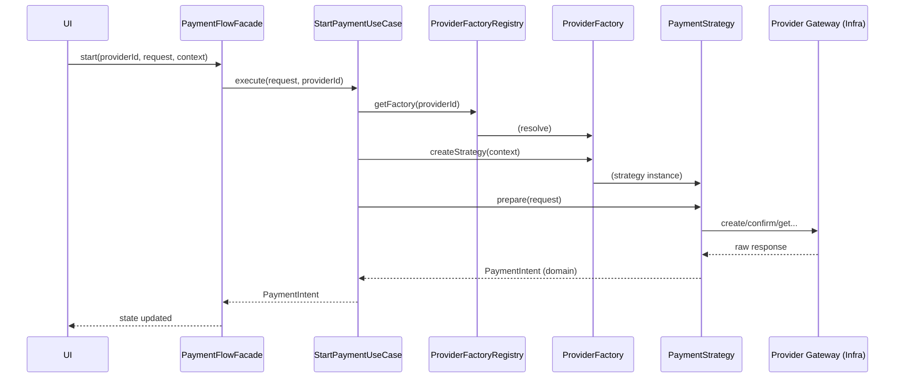

# Payment Service — módulo de pagos en Angular (laboratorio de arquitectura)

Este repo es un **laboratorio personal** para diseñar y estabilizar un módulo de pagos “de verdad” (Stripe + PayPal), construido con una arquitectura que sea:

- **fácil de probar**
- **fácil de extender** (agregar providers, métodos, reglas)
- **difícil de romper** (guardrails/architecture tests)

Sí: por dentro hay un buen de abstracción 😅.
La idea es que al principio sea _difícil de entrar_, pero una vez que entiendes el “mapa mental”, sea **muy fácil de mantener, escalar y modificar**.

---

## ¿Qué problema resuelve esta arquitectura?

Cuando metes pagos reales en un proyecto, normalmente pasa esto:

1. El provider responde raro
2. Aparece un edge-case
3. Metes un `if` en la UI
4. Luego otro `if` en la infraestructura
5. En 2 semanas todo se vuelve “intocable” 🤡

Aquí el objetivo es lo contrario:

✅ Que puedas agregar un provider nuevo sin reescribir todo
✅ Que el módulo siga siendo testeable aunque sea complejo
✅ Que errores e i18n sean consistentes (y no un “cualquier cosa”)
✅ Que fallback (Stripe → PayPal) sea una política central y no un hack

---

## Quick Start

### Requisitos

- Node 20+
- Bun (recomendado) o npm

### Instalar dependencias

```bash
bun install
# o
npm install
```

### Levantar el proyecto

```bash
bun start
# o
npm start
```

La app carga el módulo de pagos de forma lazy y trae varias páginas demo.

### Tests

```bash
bun run test
# o
npm run test
```

Para CI (no watch):

```bash
bun run test:ci
# o
npm run test:ci
```

> Nota: el runner de tests está basado en **Vitest** (ver `tsconfig.spec.json`).

---

## “¿Dónde empiezo a leer?” (ruta recomendada)

Si solo abres la carpeta y ves 200 archivos, es normal perderse.
Este es un tour de 10 minutos que casi siempre funciona:

1. **Rutas del módulo (wiring)**
   - `src/app/features/payments/payments.routes.ts`
     Aquí ves qué páginas existen y dónde se cargan los providers del módulo.

2. **Providers / composición DI**
   - `src/app/features/payments/config/payment.providers.ts`
     Este archivo “conecta” Stripe/PayPal (reales o fake), factories, use cases, store, etc.

3. **Flow Facade (API pública del flujo)**
   - `src/app/features/payments/application/state-machine/payment-flow.facade.ts`
     Es el punto de control de la UI: `start`, `confirm`, `cancel`, `refresh`, `reset`.

4. **Use Cases (los verbos del módulo)**
   - `src/app/features/payments/application/use-cases/*.use-case.ts`
     Aquí está el flujo “de negocio” sin UI.

5. **ProviderFactoryRegistry (selección del provider)**
   - `src/app/features/payments/application/registry/provider-factory.registry.ts`

6. **Infrastructure del provider**
   - `src/app/features/payments/infrastructure/stripe/**`
   - `src/app/features/payments/infrastructure/paypal/**`

7. **Domain (contratos/modelos puros)**
   - `src/app/features/payments/domain/**`

---

## Estructura del módulo (mapa mental)

Todo el feature vive aquí:

```
src/app/features/payments/
├─ config/            # Cableado DI del módulo (composición)
├─ domain/            # Modelos, contratos y reglas puras TS (sin frameworks)
├─ application/       # Use cases, puertos, store, orquestación (sin UI)
├─ infrastructure/    # Implementaciones Stripe/PayPal, DTOs, mappers, gateways
├─ shared/            # Helpers compartidos del feature (NO UI)
├─ ui/                # Páginas y componentes (render + traducción)
└─ tests/             # Guardrails de arquitectura (boundaries)
```

### Domain (lo más importante)

Es el “idioma” del módulo. Aquí defines cosas como:

- `PaymentIntent` (estado de un pago)
- `PaymentError` (error normalizado)
- tipos de request (`CreatePaymentRequest`, etc.)
- contratos (“ports”) como `PaymentRequestBuilder`

**Regla:** Domain no conoce Angular, RxJS, HttpClient, ni `i18n.t`.

### Application

Aquí viven los “casos de uso” y la orquestación:

- `StartPaymentUseCase`, `ConfirmPaymentUseCase`, etc.
- `ProviderFactoryRegistry`
- `PaymentFlowFacade` + `PaymentFlowActorService` (XState)
- `PaymentsStore` (adapter/bridge del estado)
- `FallbackOrchestratorService`

Application **no debería conocer providers específicos** (Stripe/PayPal).
Solo conoce interfaces y modelos.

### Infrastructure

Implementa lo que Application define:

- Gateways/facades que hablan con Stripe/PayPal
- mappers DTO → Domain
- normalización de errores
- fake gateways (simulación)

### UI

Páginas y componentes:

- `checkout`, `status`, `history`, `return`, `showcase`
- renderiza estado
- invoca store / use cases
- **traduce** errores (UI-only translation)

### Config

Una capa especial (solo wiring):

- aquí sí se permiten imports de todos lados
- decide si usar real vs fake
- registra factories y adapters

---

## Glosario (en español humano)

### PaymentIntent

Es “lo que está pasando” con un pago:

- `id`
- `status` (`processing`, `succeeded`, `failed`, etc.)
- `amount`, `currency`
- `provider` (`stripe` | `paypal`)
- opcional: `redirectUrl` / `nextAction` si requiere pasos extra (3DS, PayPal approve)

### PaymentError (contrato)

Los errores viajan como **datos**, no como texto traducido:

```ts
export interface PaymentError {
  code: string;
  messageKey: string; // i18n key (ej: "errors.provider_error")
  params?: Record<string, any>;
  raw: unknown; // debug, NO UI
}
```

✅ `messageKey` es una **key**, no un texto final
✅ `params` son datos serializables para interpolación
❌ Infrastructure no traduce, no usa `i18n.t`

---

## Flujo principal: “Start Payment” (paso a paso)

Ejemplo: pagar con tarjeta con Stripe (pero aplica igual a otros).

1. UI arma un request (con builder o formulario)
2. UI llama al Flow Facade
3. Flow Facade dispara evento XState
4. Actor invoca el Use Case
5. Use Case obtiene el ProviderFactory correcto
6. Factory crea la Strategy (y gateways)
7. Strategy ejecuta
8. Infra habla con el provider
9. Mapea response → `PaymentIntent`
10. UI renderiza el intent

Un diagrama tipo “secuencia”:



---

## ¿Por qué existe `ProviderFactoryRegistry`?

Porque el módulo soporta **múltiples providers** sin llenar la UI de `if (stripe)`.

En vez de esto:

```ts
// ❌ Evitar
if (provider === 'stripe') doStripe();
else doPaypal();
```

Hacemos esto:

```ts
// ✅ Mejor: pedirle al registry lo que necesito
const factory = registry.get(providerId);
const strategy = factory.createStrategy(context);
```

**Analogía rápida:**
Es como enchufes en un viaje:

- Tú no quieres reescribir tu cargador por país.
- Quieres un adaptador que te entregue _la misma salida_ aunque cambie el enchufe.

---

## ¿Qué es un Abstract Factory aquí? (sin humo)

En el mundo real, Stripe y PayPal no solo cambian “un endpoint”.
Cambian varias piezas al mismo tiempo:

- cómo se crea la orden/intent
- qué campos son necesarios (token, returnUrl, email…)
- qué flujo de aprobación existe (PayPal redirect / 3DS)
- cómo se leen status
- cómo se normaliza el error

Un **Abstract Factory** te permite pedir _un “paquete completo”_ de piezas compatibles:

- builder de request
- strategy
- gateways
- validators / mapping

**Y el resto del sistema no necesita saber cuál provider es.**

---

## ¿Por qué existen Strategies?

Porque **un provider puede tener varios “métodos”**:

- tarjeta (card)
- SPEI
- redirect PayPal
- 3DS / requires_action

Cada método tiene reglas diferentes, entonces:

- Strategy A = cómo iniciar/confirmar tarjeta
- Strategy B = cómo iniciar SPEI
- Strategy C = flujo redirect PayPal

Así evitas un monstruo gigante tipo:

```ts
// ❌ Anti-pattern
startPayment() {
  if (method === 'card') { ... }
  if (method === 'spei') { ... }
  if (method === 'paypal') { ... }
  // y crece infinito...
}
```

---

## Fallback: “si un provider falla, prueba otro”

El fallback vive en:

- `src/app/features/payments/application/services/fallback-orchestrator.service.ts`

Este servicio detecta fallas elegibles y decide:

- **modo manual:** mostrar modal y dejar que el usuario elija
- **modo auto:** intentar el siguiente provider automáticamente

**La UI no decide fallback.**
Solo responde a eventos (mostrar modal / reintentar).

> Esta parte es exactamente el tipo de lógica que se vuelve inmantenible si vive en UI.

---

## ¿Por qué podría necesitar una State Machine?

Pagos tienen estados que NO son lineales:

- start → requires_action → return → confirm → succeeded
- start → provider_error → fallback → retry → ...
- cancel vs timeout vs redirect abandonado
- reintentos con TTL y timers

Sin máquina de estados, acabas con banderas:

- `isLoading`
- `isProcessing`
- `isRedirecting`
- `isFallbackPending`
- etc…

Y se vuelve fácil meter estados imposibles como:
“estoy en redirect **y** mostrando modal de fallback”.

Una State Machine (XState) te obliga a modelar:

✅ estados válidos
✅ transiciones permitidas
✅ eventos que disparan cambios

Este repo está encaminado a eso (ver docs).

---

## I18n & errores (la regla que no se negocia)

### UI-only translation

✅ `i18n.t(...)` **solo** se permite en UI (y en shared UI global).
❌ Domain/Application/Infrastructure no traducen.

### ¿Por qué?

Porque si infraestructura traduce, el texto queda “congelado” y no se puede:

- cambiar idioma en runtime
- cambiar copy sin tocar código
- testear por key/params de forma estable

### ¿Cómo se renderiza entonces?

La UI recibe:

```ts
{ messageKey: "errors.timeout", params: { ... } }
```

y hace:

```ts
i18n.t(error.messageKey, error.params);
```

Helpers útiles:

- `src/app/features/payments/ui/shared/render-payment-errors.ts`

---

## Guardrails: “no puedes meter deuda sin que te grite”

Hay tests que funcionan como “policías de imports”:

- `src/app/features/payments/tests/payments-boundaries.spec.ts`

Ejemplos de reglas que protege:

1. UI → **NO** importa Infrastructure
2. Application → **NO** importa Infrastructure
3. Domain → framework-free
4. Infrastructure → **NO** importa UI

La idea es que sea _más difícil romper arquitectura por accidente_.

---

## “¿Qué páginas tiene?” (para probar rápido)

- `/payments/checkout` → flujo principal
- `/payments/return` → retorno de 3DS/PayPal
- `/payments/cancel` → cancelación PayPal
- `/payments/status` → consultar estado por ID
- `/payments/history` → historial de intents
- `/payments/showcase` → demo de componentes

---

## Agregar un provider nuevo (mini guía)

Cuando quieras añadir “ProviderX” sin destruir todo:

1. Crea infraestructura:
   - `infrastructure/providerx/**`
   - gateways/facades + DTO + mappers + error normalization

2. Crea su `ProviderFactory`:
   - `infrastructure/providerx/factories/providerx-provider.factory.ts`

3. Regístralo en config:
   - `config/payment.providers.ts` (multi-token factories)

4. (Opcional) agrega request builder / field requirements si UI necesita campos.

Con eso, el resto del sistema debería seguir igual.

---

## Documentación interna del repo

Si quieres “la versión formal” (north star + snapshot):

- `docs/architecture-rules.md`
- `docs/goals.md`
- `docs/stabilization-plan.md`

---

## FAQ rápido (cosas que confunden al inicio)

### “¿Por qué no usar servicios directos en UI?”

Porque en pagos el caos llega rápido. Separar capas evita que la UI se vuelva un “God Object”.

### “¿Esto es overkill?”

Sí… a propósito 😄.
El objetivo es practicar arquitectura aplicada con un caso realista.

### “¿Por qué hay providers fake?”

Porque te deja desarrollar UI + flujos + fallback sin depender de APIs reales.

---

## Disclaimer

Este repo NO es un producto listo para producción.
Es un proyecto de aprendizaje/arquitectura. **No lo uses como librería de pagos real sin hardening.**
