# Payment Service — Personal Architecture Lab

This repo is a **personal architecture lab** for a payments module: Stripe + PayPal + Fakes (for tests).  
**Primary goals:** testable, extendable, and hard to break.  
**Disclaimer:** This is a learning project — **not production-ready**. Do not use as a real payments library without hardening.

---

## Table of contents

- [Quickstart](#quickstart)
- [What to try first](#what-to-try-first)
- [Architecture maps (charts)](#architecture-maps-charts)
- [Mental model](#mental-model)
- [Key architecture decisions (why)](#key-architecture-decisions-why)
- [Walkthrough: what happens when you click Pay](#walkthrough-what-happens-when-you-click-pay)
- [Extending: add a new provider](#extending-add-a-new-provider)
- [Guardrails](#guardrails)
- [Internal docs](#internal-docs)
- [FAQ](#faq)

---

## Quickstart

```bash
bun install
bun start
```

Open the app and go to **`/payments/checkout`** (the default payments page). From there you can reach the other payment pages via links or by URL.

**Useful commands:**

- `bun run test:ci` — run the full test suite
- `bun run dep:check` — verify dependency rules (dependency-cruise)
- `bun run lint` — run ESLint (no auto-fix)
- `bun run lint:fix` — ESLint with auto-fix

---

## What to try first

These routes exist under `/payments` (e.g. `http://localhost:4200/payments/checkout`):

| Route                  | What you see                                            | What it demonstrates                                                 |
| ---------------------- | ------------------------------------------------------- | -------------------------------------------------------------------- |
| **/payments/checkout** | Checkout form (provider, method, amount) and Pay button | Main flow: start payment, next actions (redirect/3DS), fallback      |
| **/payments/return**   | “Payment completed” or similar after redirect           | Return from 3DS or PayPal; flow continues without extra UI logic     |
| **/payments/cancel**   | Cancel/abandon outcome                                  | PayPal (or other) cancel path; same return component, different data |
| **/payments/status**   | Form to look up a payment by ID                         | Status lookup without going through checkout                         |
| **/payments/history**  | List of past intents (from store)                       | Read model / projection for UI                                       |
| **/payments/showcase** | Demo of payment-related components                      | UI components in isolation                                           |

---

## Architecture maps (charts)

Two maps explain the system: **runtime** (who talks to whom during a payment) and **dependencies** (what is allowed to import what — the guardrails).

**Runtime: what talks to what during a payment**



**Dependencies: what may import what (guardrails)**



**Payment flow: what is the machine purpose flow**


**How to use these maps:** When you feel lost, start at the centre (the **Flow** / state machine), then follow the bridges to the **store**, **UI**, and **providers**. The runtime map shows the live flow; the dependency map shows the rules the repo enforces so the architecture stays consistent.

---

## Mental model

- **UI** — Renders state, collects input, shows next steps and errors. It does not orchestrate; it calls the flow API and reacts to the store.
- **Store** — A read model / projection for the UI (loading, ready, error, history, fallback). It is **not** the brain; it only reflects what the flow engine decided.
- **Flow engine (state machine)** — The “brain”: it decides what happens next (start, confirm, redirect, webhook, timeout, fallback). All payment sequencing lives here.
- **Next-action** — How the system models “extra steps” (e.g. 3DS, “approve in PayPal”, redirect). The flow produces a **next action** (e.g. redirect URL or client confirm); the UI renders it generically.
- **Fallback** — A policy subsystem: when a provider fails, the orchestrator can suggest or trigger a switch (e.g. Stripe → PayPal). This is not a UI hack; it is testable and consistent.
- **Providers** — Interchangeable implementations (Stripe, PayPal, Fake). They sit behind a registry/factory; the rest of the app does not branch by provider name.
- **Telemetry** — Structured breadcrumbs (flowId, providerId, state, event, refs) so you can debug and verify behaviour. Redaction rules keep logs safe (no secrets, no raw PII).

---

## Key architecture decisions (why)

This section is the core: each decision exists to avoid a specific failure mode.

### 6.1 Why a state machine for payments?

Payments are **non-linear**: redirects, retries, timeouts, webhooks, and race conditions. Without a clear model you get a **flags soup** and impossible states (e.g. “redirecting” and “showing fallback” at once). A **state machine** gives explicit states and explicit events so behaviour is predictable and testable.

### 6.2 Why the Store is NOT the brain

The **store** is a **projection** for the UI — it reflects the current snapshot, fallback state, and history. Orchestration (what to do next) lives in the **flow engine**. Keeping the store as “read-only view” keeps the UI simple and testable and avoids business logic creeping into the view layer.

### 6.3 Why providers are behind a registry/factory (no "if stripe")

The app must support **multiple providers** without `if (provider === 'stripe')` in the UI or application layer. A **registry/factory** lets you add or replace providers by implementing a contract and registering it; the rest of the system stays provider-agnostic. Provider-specific rules stay contained in infrastructure.

### 6.4 Why "Next-action" exists

Some payments need **extra user steps** (open URL, complete 3DS, approve in PayPal). Instead of hard-coding each step in the UI, the flow models them as **next-action** data (e.g. kind: redirect, client_confirm). The UI renders by kind; the flow engine decides what the next action is. That keeps the UI generic and the flow in charge.

### 6.5 Why fallback is a policy subsystem

When a provider fails, “try another provider” should not be a one-off UI hack. **Fallback** is a dedicated policy: the orchestrator decides eligibility and mode (manual/auto), and the flow consumes fallback events. That makes failure handling consistent and testable.

### 6.6 Why errors + i18n are separated

Errors travel as **structured data** (e.g. `messageKey`, `params`). The **UI** translates; infrastructure never hardcodes user-facing copy. Benefits: stable tests (assert on keys/params), easy copy changes, and a single place for translation.

### 6.7 Why telemetry exists (PR6 outcome)

Debugging **asynchronous** flows (webhooks, redirects, timeouts) is hard without a trail. **Telemetry** records structured events (command sent, state changed, effect start/finish, error raised) with flowId, providerId, and refs — and redaction so secrets and raw PII never reach logs. It supports both stress tests and real debugging.

---

## Walkthrough: what happens when you click Pay

1. **UI** builds a payment request (provider, method, amount) and calls the flow API (e.g. start).
2. **Flow engine** receives the command and decides which provider/method to use (via registry).
3. **Flow** triggers the right **effect** (e.g. create intent); the **provider** (Stripe/PayPal/Fake) is invoked.
4. **Provider** returns an intent (e.g. `requires_action` with redirect URL or next step).
5. **Flow** updates its state and may emit a **next-action** (e.g. “redirect to this URL”).
6. **Store** (projection) is updated from the flow snapshot; **UI** re-renders (loading/ready/next step/error).
7. User follows the next action (e.g. redirects to 3DS or PayPal).
8. **Return/cancel** or **webhook** hits the app; an **adapter** normalises it into a **system event** (e.g. redirect returned, webhook received).
9. **Flow** consumes the system event (with correlation/dedupe) and may move to finalising or reconciling.
10. **Provider** is called again if needed (e.g. finalise/capture); **flow** converges to success or failure.
11. **Store** reflects the final state; **UI** shows result (success/error/history).
12. **Telemetry** has recorded commands, state changes, effects, and errors so you can trace the run.

---

## Extending: add a new provider

High-level checklist (no deep code here):

1. **Implement the provider adapter** — Create/confirm/status/cancel (and any method-specific steps), plus error normalisation and DTO mapping. Implement the same ports the existing providers use.
2. **Register it in composition/config** — Add your provider’s factory and wiring to the config that composes the payments module (so the registry can resolve it).
3. **Add minimal tests** — Unit tests for gateways/normalisers and at least one stress-style scenario (e.g. idempotency or terminal safety) so the new provider is covered by the same guarantees.
4. **Run test and lint** — `bun run test:ci` and `bun run lint` must pass.

The rest of the system (UI, flow, store, next-action, fallback) should stay unchanged.

---

## Guardrails

The repo protects its own architecture:

- **UI cannot import infrastructure** — Pages and components do not import Stripe/PayPal adapters directly; they use the flow API and the store. Dependency-cruiser and boundary tests enforce this.
- **Domain is framework-free** — The domain layer has no Angular, RxJS, or XState; it stays pure types, contracts, and rules.
- **Shared keeps Domain agnostic** — The payments `shared/` layer must not import `@core` (i18n, logging). Depcruise rule `shared-no-core` enforces this. Error/message keys live in `shared/constants/`; `SpeiDisplayConfig` in `application/api/contracts/`; SPEI display data (bank names, beneficiary, test CLABE) is injected from infrastructure constants.
- **Architecture tests yell early** — Tests (e.g. boundary/import rules) fail the build if someone breaks these rules.
- **Value Objects in domain** — Core contracts use `Money`, `PaymentIntentId`, and `OrderId`; builders validate at the Application edge before emitting requests.

So: you can rely on "UI → application → domain", "shared → domain only", and "infrastructure → application"; the tooling checks it.

---

## Internal docs

For deeper detail, read these (no content copied here):

- **docs/goals.md** — North star and intent
- **docs/architecture-rules.md** — Layers, boundaries, Value Objects, and current state
- **docs/flow-brain.md** — State machine and transitions
- **docs/observability/flow-telemetry.md** — Telemetry envelope, redaction, sinks

---

## FAQ

**Why so much structure?**  
Payments get complex quickly (redirects, webhooks, retries, fallback). Structure keeps behaviour predictable and testable so you can add providers and features without turning the codebase into a tangle of conditionals.

**Is this production ready?**  
No. This is a learning/architecture project. Use it to study design and patterns; do not deploy as-is for real money without security, compliance, and operational hardening.

**Can I use this as a library?**  
Not as a drop-in library. You can reuse ideas, patterns, and structure in your own project, but the repo is an app with its own routes and config. Copy and adapt what fits your context.
